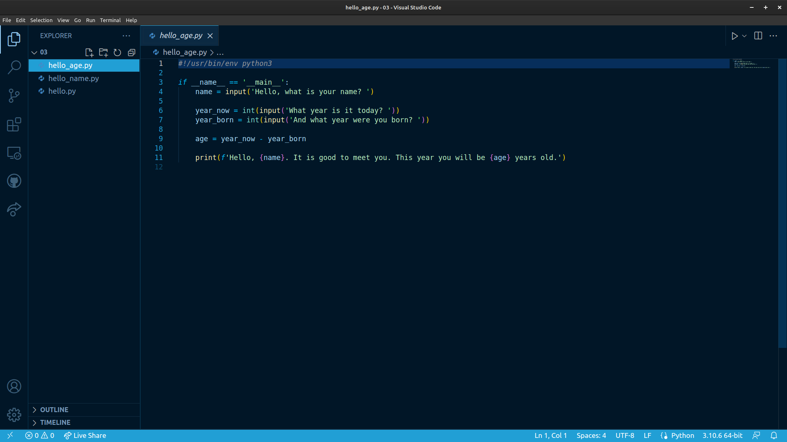
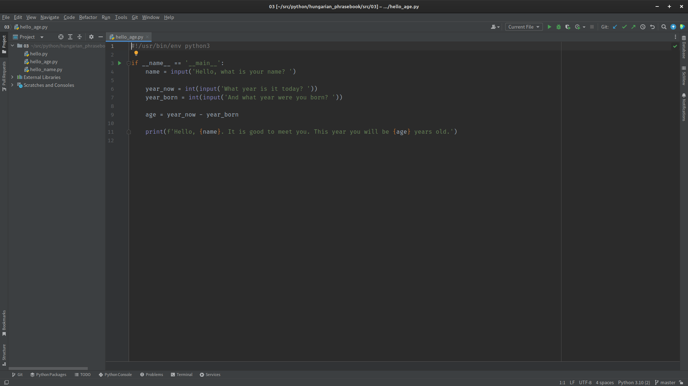

======================
Getting Stuff Together
======================

Promised we would go slowly. But it's very important that we get everything in place before starting to program. That way we will be able to concentrate on the actual programming, rather than getting distracted tweaking the environment.

So, now to get everything together so that we can start programming. You may already have access to the required software provided by someone else, but there really is no substitute for setting it all up yourself. For one thing, you learn how to do it. For another, you can set things up just as you find you like them. No two programmers work in the same way. If you want to get good at this you are going to have to think about how you work best.

.. important::

    Bearing in mind that every programmer works best in a different way, this book will not assume that you are using any particular tool. It's up to you. By all means ask for recommendations, but don't feel you have to follow them!

First, we need a reasonably powerful PC or laptop [#lappybest]_; anything from the last five years or so will be fine. The programs we will be working on here are not going to need huge amounts of system resources, so that old laptop on the shelf will do fine if you blow the dust off. There are no important requirements for disk space or memory for Python itself, but when we come on to think about development environments you might want to check out their requirements.

So, having dusted off some kit, and that it has a web browser and Internet connection, there are two main things to get installed.

1. The Python language.
2. An IDE or editor that will allow us to edit (and ideally run) programs.

.. important::

    Any section like this is very difficult to keep up to date, as versions are always changing, and web resources are moving. Be prepared to seek out information if things don't look exactly as described here!

But first let's consider the operating system itself. The choices start there.

A Note on Operating Systems
===========================

The operating system is the software that makes the computer "go". It controls access to files, takes care of video and audio, and does all the things that makes the computer useful. Strictly speaking, on top of the operating system there is a window manager, which deals with all the tricky bits of the interface, but in some operating systems the distinction is rather blurry.

It is likely that the operating system you have used most up to now is some flavour of Microsoft Windows. Before we start programming, this is a good point to pause and to realise that there are alternatives to Windows. Windows is just the operating system running on your computer. In many cases it is possible to replace it with something different.

Of course, Apple Mac macOS systems provide one such alternative, all in a very attractive Apple package, and closely tied to their very neat hardware. This is a very popular setup among programmers who prefer an interface with a rich look-and-feel, and (if we are honest) also think that the hardware itself looks cool.

The Open Source operating system Linux is also popular with programmers, who value its free-ness, power, and customisability. Linux systems come packaged as *Distributions* (usually "distros"), and generally "just work" when installed on standard hardware. Popular distros at the moment are `Ubuntu <https://ubuntu.com>`_ and `Linux Mint <https://linuxmint.com>`_. Both these allow a wide choice of window managers, which in turn allow uses to customise their systems to their precise liking.

So there is a choice. The most recent `StackOverflow Developer Survey <https://survey.stackoverflow.co/2022#section-most-popular-technologies-operating-system>`_ showed that macOS and Linux are only a little behind Windows in the current popularity stakes. Windows obviously has a huge advantage is terms of number of users as it comes installed on most laptops, even if the user has no intention of using it.

Using macOS obviously requires buying a Mac, so this is a choice not to be made lightly!

Linux, however, is free, and is easy to install. It even lurks within Windows in the form of the `Windows Subsystem for Linux <https://learn.microsoft.com/en-us/windows/wsl/install>`_. Most Linux systems will boot from a USB drive, allowing you to try them out without installing anything. `A flavour of Ubuntu <https://ubuntu.com/#download>`_ or `Mint <https://linuxmint.com/download.php>`_ are good places to start. And if you know a Linux user they are very likely to be very keen to show you how it works.

Linux is also a lot less resource-hungry than Windows, so it can be a fine choice for older hardware that struggles to run current versions of Windows.

This book is not going to preach about which operating system is best to use, although it was created on Linux, specifically Linux Mint with the Cinnamon window manager. The message is that you should be using the operating system that makes you the most productive. You should know that there is a choice, and you shouldn't be using something just because you always have done! And whatever system you choose, make sure you *really* understand how to use it.

Ok. Sermon over. Let's get Python flying.

Getting Python
==============

Python is free, and can be downloaded from `The Python Home Page <https://www.python.org>`_. At the time of writing the current version is 3.11.4. The Downloads section lists the currently available versions, and shows for how long each is supported. If you have a choice, just pick the most recent.

There are Download links for Windows and Mac. Windows users will also find it in the Windows Marketplace, but it is usually easier to install from the main Pythin downloads page, and this also means that the version will be the latest one.

Linux users most likely already have Python installed [#linuxversion]_, so have nothing to do. Opening up a terminal and typing::

    $ python3

will reveal, and will probably show the commands to install if Python is not found.

New versions of Python are released regularly. It is unlikely that you will need to update while you are learning the basics but if you do, head back to the Downloads page. Linux users will find that Python will just update automatically, Windows and Mac require fresh downloads.

.. important::

    Whatever version you install, be very sure that it is some flavour of Python 3. Downloads for the old Python 2 are still available for various good reasons, but Python 2 cannot run most programs written in Python 3.

The Python Interpreter
**********************

As mentioned before, a useful feature of Python is the *Python Interpreter*, a handy tool for testing out code. It will serve here to check that we have Python installed.

.. hint::

    The default prompt in the Python Interpreter is three `>` characters. And by convention whenever you see this::

        >>> print('Spam and Eggs')

    this shows code being typed at the interpreter prompt. Be sure not to copy the prompt if you copy this code.

Firing up the interpreter will show the current version of Python running. It can be found by hunting through menus on Windows (so consider making a shortcut on the Desktop or in the Taskbar), or on Linux by opening up a command-line and typing::

    $ python3

The response will be something along the lines of::

    Python 3.10.6 (main, May 29 2023, 11:10:38) [GCC 11.3.0] on linux
    Type "help", "copyright", "credits" or "license" for more information.
    >>>

So here we have Python version 3.10.6, which happens to be running on Linux. Things will obviously look slightly different on Windows.

To exit the interpreter, simply issue the `exit()` command::

    >>> exit()

Assuming you see the interpreter, you do have Python, and can carry on to install an IDE.

Choosing and Getting an IDE
===========================

An IDE (that's *Interactive Development Environment*) is a tool that allows a programmer to create, edit, and run programs, all in one handy interface. They are not strictly required for programming, and using one does introduce something else to learn, but in the long run a good IDE makes the whole programming task easier and more enjoyable.

There are many choices here, and as with operating system, this is a personal choice. The important thing again is not just to use a tool because you have been told to. There are many, many choices. And the choice you make now may well stick with you through your whole career. Evaluate some of the options, and pick the one that fits best with your needs.

.. tip::

    Most of the modern IDEs look basically the same, and many share similar menu structures. Keyboard commands are similar, too. It is general that `<CTRL>-Z` will undo the previous edit, for example. So, if you pick one IDE for now, it would not be too much effort to change to another later.

This section will outline some of the main choices, but there are more. Remember that most of the popular IDEs will run on any operating system, so the choice of one does not impact on the choice of the other.

A second glance at the `same StackOverflow Developer Survey <https://survey.stackoverflow.co/2022#section-most-popular-technologies-integrated-development-environment>`_ shows the current state of play. *Visual Studio Code* is the top choice. This is Microsoft's free code editor offering, which started out life as part of Visual Studio. If you look into these, be sure to realise they are different things!

This score is a little artificial because VS Code has an ecosystem of plugins that means it can be used to work with any language, making it a very general-purpose tool, popular with developers using different languages. The third choice, JetBrains IntelliJ is for Java only. Its Python cousin, PyCharm, is also high on the list, as are their close relatives WebStorm (for JavaScript), PhpStorm (PHP), and others from the same stable. So VS Code is top, but not by as much as it might seem.

An obvious reason for its popularity is also that VS Code is free. JetBrains IDEs are commercial software, and require a paid-for licence. to any business employing a significant number of developers, this is important! But JetBrains do offer free versions of their most popular IDEs - IntelliJ and PyCharm - so that does keep the competition going.

Let's look at the two obvious contenders. The screenshots here are taken on Linux, but the IDEs look the same on other operating systems.

Visual Studio Code
******************

This is a relatively new tool, but one that has gained a lot of traction very quickly. It is available for Windows, Mac, and Linux, and is extremely configurable and tweakable. Certainly it's a tool that is not going to go away any time soon. Pedantically, VS Code is a *text editor* rather than an IDE, because out of the box it has limited support for specific languages.

The image above shows VS Code being used to create a short Python program. The plug-ins for Python have been installed, and a dark blue colour scheme (*Winter is Coming*) is in use. The small arrow to the top right would run the program, with the output appearing just below the program code. All very neat.

VS Code also scores in the popularity stakes because it is free. It can be `grabbed for free <https://code.visualstudio.com>`_. The download page detects your operating system, and offers helpful instructions. It is then a case of installing plug-ins (called *extensions*) for the required languages. This is just a case of opening the settings, and searching for "Python".

VS Code is being actively developed, and new features are added regularly. It is a fine choice of IDE, especially if you plan to use different languages for other projects.

PyCharm
*******

PyCharm is a commercial product [#jetbrainsaccount]_, developed and marketed by `JetBrains <https://www.jetbrains.com>`_. Happily there is a free "Community" version; this lacks many of the features of the "Professional" product, but those are not likely to be of any interest to us here. The Community Edition will be fine. It is a straightforward download.

The image above is actually the "Professional" version of PyCharm; the "Community" version would have fewer menu options across the top. It is using a third-party plugin for a theme, again a dark one. Clicking the small green arrow to the left of the program would run it, and the output would appear below.

As a full-featured IDE, PyCharm will do a lot more out of the box than VS Code. This is a good thing in that there is less to install and PyCharm is the more powerful of the two. But it can be a bad thing in that many of the options available are irrelevant to the current project, and can get in the way. This is probably why in early 2023, JetBrains started development of a new interface for PyCharm.

This new interface is less cluttered (all the menus are actually still there, hidden under the "burger" top left), allowing the programmer to concentrate on the task at hand. At the time of writing this, the new UI is available under the Settings panel. It reduces the number of options that are available by default, with the result that it makes PyCharm look rather like VS Code, which may not be entirely a coincidence. This new interface is *highly recommended*.

Picking and Choosing
********************

The choice of IDE is a personal one, but also one that can stay with you for a long time. Neither PyCharm or VS Code is going to go away any time soon, so time invested in learning how to use them is time well spent. Both are highly customisable - colour schemes are just where it starts. It is worth spending time seeking out tutorials and other hints and tips.

Think of this process as being similar to buying a new car. It is usual to test drive a few new cars so as to get a feel for them. And also to investigate what options are available, and how they can be customised. There is no one car that is universally acceptable, and likewise there is no one IDE.

Your IDE is going to be the main tool you use when programming. Tools are very personal things. It is worth getting them right.

.. note::

    When using an IDE, much of the operating system underneath is hidden. PyCharm or VS Code work much the same on Windows, Linux, or Mac. This means that while the operating system choice might seem the most important, it really isn't. This book was written with PyCharm, usually running on Linux, but occasionally on Windows. Needs must.

There are obviously other options for creating programs. After all, they are just text files, so good old *Notepad* would do the job. Use whatever tools make you most productive. But make them yours.

Other Tools
===========

It's also worth considering spending some time looking at other tools that will be of use when programming. Obviously some sort of backup solution will be needed, for example. This could be some simple Cloud-based storage, such as OneDrive that comes bundled with Windows.

.. important::

    A USB stick is not a backup solution.

It is also worth looking at *version control* tools. These are tools that keep track of programs as they are developed, changed, and otherwise maintained. These will become essential later on, but there is no good reason not to get started with them now. The standard is `Git <https://git-scm.com>`_ which is free and available for all operating systems. There are plenty of tutorials to give you the basic idea, and Git is actually built in to both VS Code and PyCharm.

A site like `GitHub <https://github.com>`_ combines version control and cloud storage [#othervcs]_. As well as keeping work safe it is also a fine place to build a portfolio of work, such as a `Book <https://github.com/TonyJenkins/hungarian_phrasebook>`_. As we work in more mobile ways, it is very useful to keep program code in the Cloud, so that it can be downloaded and work on using whatever PC or laptop happens to be available at the time.

Takeaways
=========

The most important messages here are:

#. Choose your toolset for programming wisely. Listen to others, but make the choice yourself.
#. Once chosen, customise it. Devote time to this. Get it *just right*.
#. Time invested in learning and customising tool might not produce any programs, but it is not wasted time. Quite the opposite, it is time that will pay you back over and over again in the future.

This book includes Python programs, so then whole thing was developed using PyCharm (new interface, tweaked colour scheme). The files themselves are on GitHub. The reason for all this is that is what the author prefers to use. You are encouraged to be different!

Now, let's make some code.

.. [#lappybest] A laptop is best, because it can come with you. The ideal setup for most programmers is a laptop along with an external monitor on any desk where they are likely to roost.
.. [#linuxversion] The way that Linux distros are updated means that this might not be the latest version. That's fine. The version will update from time to time.
.. [#jetbrainsaccount] JetBrains offer educational discounts for students and staff. At present this consists of free access to the full versions of all their tools. All that is usually required is to create an account with a University or College email address.
.. [#othervcs] See also `GitLab <https://about.gitlab.com>`_, `BitBucket <https://bitbucket.org/product>`_.
