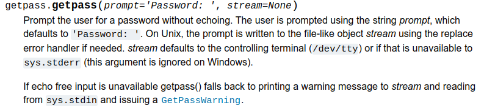

==========================
The Wheel. Do Not Reinvent
==========================

Python is quite a small language. We have already looked at most of the more important features, and will spend the next few chapters filling in some more details. For a moment we will pause, though, and look at some of the ways in which we can use useful *modules* of program code that come with Python. And in passing we'll mention some of the many other ways in which Python can be extended.

In many ways, modern programming is case a case of bringing together "stuff" from many sources into a whole that solves some new problem. A modern app might use a database, a framework for web applications, a toolkit for developing front-end websites, and more. Even with just a programming language there are many extensions and handy collections of code that can make our lives easier.

And using them is not cheating! Using them is just what professional programmers do. Not using them is just making more work for yourself.

Moreover, Python exists in the open source world, so many of these extensions are developed, tested, and used by huge communities across the world. Any bugs are quickly found and dealt with, and packages are extended and new versions released regularly. This means that you can be confident that the extensions you are using are tried and tested, and maybe you will be able to contribute to the community yourself one day.

Let's illustrate this with a simple programming task:

.. topic:: Check a String

    Validate a user's input to ensure that the first character of a string they enter is an uppercase letter, and the last is a period (full stop).

We could start thinking about this problem along these lines::

    Hmm. We can get the first character of a string at index ``0``, and we
    can somehow write an ``if`` statement. Maybe we can see if it's
    between ``A`` and ``Z`` or something. The last character will be index ``-1``,
    and testing that will be easy.

This is the wrong way to think! Looking for uppercase letters, and checking how a string ends sound like they might be common things to need to do. They are. And so *there is a built-in way to quickly and easily do either*. This is always the way to think - does what I am trying to do seem like something that has been done many, many times before?

For the record, there is a built-in function in Python called ``isupper`` that will tell us if a character is an upper case letter. There is another for testing how a string ends, imaginatively named ``endswith``. So to validate the string as required it's just a case if gluing these two together:

.. index:: single: Programs; string_check.py
.. literalinclude:: /../../src/07/string_check.py
   :language: python
   :caption: ``string_check.py``

.. tip::

    Another advantage of using built-in functions like this is that the resulting code when "read aloud" can often do a very good job of saying what the program is doing.

Of course, we do not know how ``isupper`` and ``endswith`` work. Nor do we want to know, or need to know. We just know what they do, and how we use them. We trust that they have been tested thousands of times, and are trusted.

.. tip::

    As you enter a program, your IDE may well pop-up helpful hints about what you might want to type next. Look at these, and you will see possible functions that might come in handy later on.

These handy building blocks are available to us in two ways. Some, the most commonly used, are found in the *Python Standard Library*. Others, needed less often, are available for download as packages; these are found in the *Python Package Index*, which is sometimes affectionately known as *The Cheese Shop* after a famous Monty Python sketch.

The Standard Library
====================

Many of the things we have mentioned so far - the built-in data types, for example - are part of Python's *Standard Library*. The library provides, in its own words "standardized solutions for many problems that occur in everyday programming". So this is the place to look for something that solves a problem that crops up in many different programming scenarios. It is safe to assume that the Standard Libray is available wherever Python is installed.

The contents of the Standard Library are listed in the docs at https://docs.python.org/3/library/index.html . You can tweak the drop-down at the top left of this page to change to the exact version of Python you have. Reading down the list we see:

More Data Types
    There is a richer collection of data types, mostly to handle collections of primitive data items. We have those in the plan for the next chapter.
More Exceptions
    We have used a few of the more common exceptions, but there are more, and they cover every likely mishap. (You can actually add your own, but that's beyond our scope at the moment).
Collections of Code
    And then there are many collections (correctly called *modules* of useful code for common programming situations. These are the places to look for solutions to common problems.

The last here is worth pausing over. Take a look down the list and you see a whole bunch of potentially useful stuff for common applications. These are available, effectively built-in to Python, so there really is no good reason not to make use of them. Some of them are quite esoteric, and are probably used rarely. Some are useful much more often. Even experienced programmers should glance down the list now and again to remind themselves of what's available.

Here's an example. Suppose we have a file processing program, and we need to write some temporary data to a separate file. We need to generate a name for that file. Without thinking we might start writing some code to string a few characters together to form the name. Then we might stop and wonder what to do if it turned out somehow that the file already existed ... But, look, here is the ``tempfile`` module. It contains code that will create a temporary file for us, and guarantee the name is unique. That is super-neat.

Some of the more commonly used modules are (in the order they appears in the docs):

``string``
    Handy functions for processing strings (in addition to those that are always available).
``textwrap``
    Useful for consistently shortening lines of text, adding line breaks, and so on.
``datetime``
    One of many modules for handling dates and times, getting the current time, doing maths on dates, and more.
``math``
    All the usual maths functions you might remember from A level, and that calculator.
``decimal``
    Used for fixed-point numbers. Very useful when a value always has to have the same number of decimal places, often for amounts of money.
``fractions``
    For maths on, ah, fractions.
``random``
    Functions to generate pseudo-random numbers, make random choices, and the like. Useful in games and statistics.
``statistics``
    What it says! Don't code standard deviations, modes, and medians, they're in here.
``os.path``
    A handy interface to manipulating files on the system. See also ``shutil`` for a higher level interface.
``zipfile``
    For creating and opening Zip files. There are also modules for other common compression and archive formats. This is ver useful if you don't have WinZip or similar to hand.
``csv``
    For opening and processing files in comma-separated value format. Files exported from Excel usually.
``getpass``
    Reads a password (without it being displayed on the screen).

There are plenty more, but the later parts of the list get a bit specific. There are modules that provide functions for various Internet protocols, different multimedia, basic GUIs, testing, and many more.

So, if all this is available, how do we get at them? Let's do a simple example.

A Module Example
----------------

Here's a task:

.. topic:: Password

    Write a program that reads a password from the user, twice, and confirms that the two passwords entered are the same. For debugging, display the password entered, along with the user's login name.

Eek! Where to start with that? Read the password is easy with ``input``, but we know that the user's typing will be displayed. And how to find out who is logged in to the computer? All very tricky.

Obviously this is an example, and obviously the last module listed above, ``getpass`` is going to be our friend here. To find out what it can do, we can reads the docs, Google for an example (often a better call), or check the built-in help. To start using a module it needs to be made available, via an import:

.. code-block::

    >>> import getpass

And then there are two ways to remind ourselves of what is available in the module. The first just lists the names of the contents, and the second provides more details.

.. code-block::

    >>> dir(getpass)
    >>> help(getpass)

Initially, you may find the built-in help, and the official docs, a bit difficult to follow. That's not a problem - a quick Google will surely lead you to an example of how to use the module.

The official `docs <https://docs.python.org/3/library/getpass.html>`_ for the module tell us that there are two functions in this module. One gets a password, *without echoing on the screen*, and the second gets us the current user's id. These will surely simplify writing this program.

First, to get the password. The docs for this function tell us much:

We see that:

* We use the function as ``getpass.getpass``. This is the usual deal, where a function is referenced with its name and the name of its module. It covers the chance that two modules will contain functions with the same name.
* We provide a prompt. If we do not, then ``Password:`` will be used (with a space).
* On Unix-like systems, we can read from different streams. This can be ignored.
* The password will not be displayed. If it could be, then a ``GetPassWarning`` exception will occur. Since this exception is also defined in the module it will be ``getpass.GetPassWarning``.

So to make our program we will need to:

#. Import the ``getpass`` module.
# Prompt the user for a password.
#. Prompt again to re-enter (a different prompt here would be good).
#. Compare the two, and display the user's id if they match.
#. Display an error if they don't match.
#. Display an error if it is not possible to enter the password without it displaying.

Phew! This looks a bit deep, but using the modules, it's very neat. Here we are:

.. index:: single: Programs; password.py
.. literalinclude:: /../../src/07/password.py
   :language: python
   :caption: ``password.py``

The ``import`` goes at the top of the program, before the start of the ``main`` part of the code. This is another convention that it is important to follow. (If there are multiple ``import`` statements, another common convention is to include them in alphabetical order). Then the program just uses the module.

If you type this program into your IDE you will probably find that it is aware of the module, and once it has been imported, the IDE will suggest the names of the functions. That saves remembering them.

A final point is that this module we are using here is *cross-platform*. That is, it will work on any operating system. The version you are looking at above was written on Linux, but it would also work on Windows or Mac. Obviously Unix-like systems (Linux and Mac) manage users and passwords in different ways to Windows, so this really is a big thing. Using these modules there is no need to develop and maintain different versions of a program for different operating systems.

Now, some more details about good practice in imports.

Importing
---------

In the password example we wanted to make use of everything defined in the module. There were only three things there, in fact. Other modules contain many more functions (and other stuff), and typically a programmer doesn't need all of them for a particular task. So it is good form to only import the parts of a module that are needed. Example:

.. topic:: Triangles

    Write a program that takes the lengths of two sides of right-angled triangle, and displays the length of the third side.

For anyone who may have slept through maths, the requirement here is to square the two numbers given, and display the square root.

.. important::

    For simplicity, we will ignore the need to validate the numbers input here. But we will return to this issue later on in the chapter. So don't panic.

Obviously square roots are a common thing to require in many maths applications, and a function can be found in the ``math`` module. As before, we do not know how it works, nor do we care. We just need to know we can give it a number, and it will give us back the answer we need. But there are many more things in the ``math`` module that we don't need, so we use a different ``import`` that states explicitly what we want.

.. index:: single: Programs; pythagoras.py
.. literalinclude:: /../../src/07/pythagoras.py
   :language: python
   :emphasize-lines: 3
   :caption: ``pythagoras.py``

Importing in this way have a few advantages. First, it is obvious to someone reading this program that it will make use of square roots, but nothing else "maths-y". Second, it saves invisibly including other things that might have names that could possibly clash with variable names. And, third, there is small saving in that there is now no need to add the name of the module before the name of the function.

.. note::

    If you look closely at the line in that program that calculates the answer, you might realise that the two sets of brackets are redundant because multiplication always happens before addition. This is true, but leaving them in, as here, can make it more obvious what the line is doing (squaring, then adding).

    Never forget that programs are written to be read as well as run.

The same approach works with any module, and typically a program will have several ``import`` statements at the top. Let's finish this section with a quick look at other Python Packages.

The Python Package Index
========================

The `PyPi <https://pypi.org>`_ contains packages contributed by the Python community that have not made it into the standard distribution. This is simply because it makes sense to keep what is distributed small, and nothing to do with the quality of the submissions. Some of them are very highly regarded, especially in fields like Data Science.

This book uses a bunch of packages out of PyPi. One example is `Pygments <https://pypi.org/project/Pygments/>`_ which takes the program source code, and produces coloured and highlighted exampled, as you've seen many times by now.

Managing packages can be tricky, and is beyond out scope here. Packages often depend on others, and this can lead to a web of interconnected dependencies. The standard Python tool is ``pip``, which is only a Google away should you want to try it out.

If the standard library packages fail to meet a need, it is always worth searching over PyPi. But you do need to evaluate what you find there. Things to look out for include the number of "Stars", the most recent updates, and the quality of the docs. You should also check that the licence allows you to use the package for your intended purpose.

Among the PyPi packages that might be of interest are:

``cryptography``
    Avoid having to code all those crypto algorithms with this.
``python-dateutil``
    Adds to the existing ``datetime`` module with things like "next month". Very useful for calendar apps.
``numpy``
    The standard package for scientific computation.
``pandas``
    Powerful package for Data Science. (An example of a dependency is that Pandas makes much use of, and therefore requires, NumPy.
``beautifulsoup``
    Used for processing HTML pages to extract information - "screen scraping".

But in general, if you need to do it, there is probably a package.

Packages on PyPi are all free, but are released under different licences. Sometimes the original author would like a credit in anything that uses the package, for example. A few exclude commercial use. These can be ignored, but it is good form to read and abide by the licensing terms.

Takeaways
=========

This chapter introduced the idea of a *module* of useful things. These things might be functions (which are handy bits of code), or new exceptions. They can also include constant values (the ``math`` module include a value for Pi, for example). The key points:

* It is important to look through the standard library and get an idea of what it there.
* PyPi contains many more packages, generally more specialised.
* The ``import`` statement includes a package. It does above the ``main`` part of the program.
* It is best practice to import just that which is needed, using ``from ... import``.
* Using library functions is helpful in writing programs that will run across different operating systems.
* Licensing is not be ignored.

Using modules also allows us to split a large problem into smaller ones. We have seen before how this is a crucial part of programming. Now we will go on to see how we can develop our own "chunks" of programs, that we can reuse in different applications. And we can organise them into modules, should we want.
