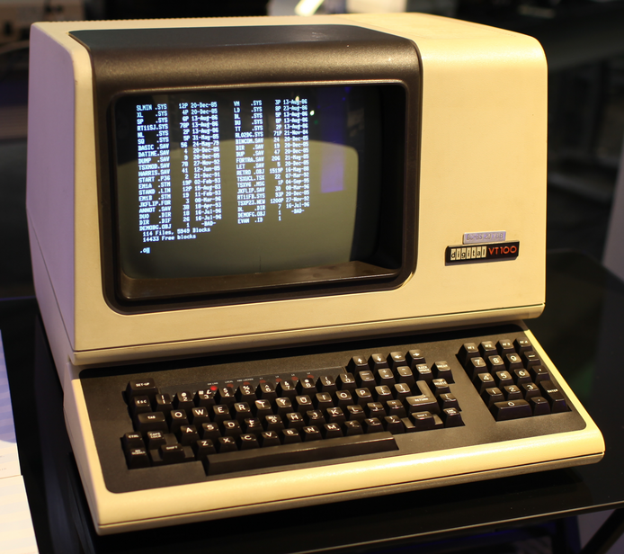

=================
Keeping it Simple
=================

Right at the start of the book we went through some basic ideas that, together, formed what you need to know to start programming. If you look back, you will see that we have now covered everything. Sure, there are some things that will make our programming lives easier, and some features of Python that need a mention, but everything is very much there.

We could use what we have learned to write complex programs. But there would be a problem. These programs would quickly become very long, and the whole process would be unsustainable. How would we cope if a small change in a program at line 11 caused an expected error at line 276? Or even line 102982? Complex systems are made up of tens of thousands of lines of program code, often more. No-one can cope with that complexity, so there needs to be some way to keep the day-to-day programming tasks to something we can comprehend.

So, how many lines of program should a developer be working on? A reasonable rule these days would be an *absolute maximum* of 50, but ideally far fewer. The guideline used to be around 20, going back to the days when programming was done on a single-screen dumb terminal.

The guideline really is that a programmer should be able to see *all* the code they are working on, without scrolling up and down. In the olden days, this was about 20 lines. Now it's a few more, but not by much.

The ideas in this section are all about keeping the amount of code a programmer works on down to a reasonable limit. But first, some more to convince you that this really is a good idea.

Code is Crafted
===============

A common saying these days is that programming is a *craft*. This means many things, but essentially it tells us that programming is all about producing good, elegant solutions, that can be maintained and repaired, and that will work for a long time. It is not enough for a program to work - it must work well. Or, if you prefer, it should be *crafted*.

Think about a craftsperson making a chair. A chair can be made by nailing a few pieces of wood together, and screwing some legs on. But that would not produce a good chair. A good chair has to fulfill its basic function, but is also needs to looks good. If it is well made, and we will be happy to have it in our homes. We would expect a good chair to be used for a long time, and we would expect to be able to repair it. We would expect it to have been well made, or *crafted*.

.. note::

    A while back, we used to say that software (programs) was *engineered*. And there was a whole discipline called *Software Engineering* and people called *Software Engineers*. It's still a reasonable reference - good programs are built and structured well in a similar way to complex machines - but it does seem to have fallen out of fashion.

Here are some ideas that help us think about what makes code good, or indeed *crafted*.

Code is Read
************

Code is read much more than it is written. This implies that good code should be readable, so that a programmer who is not the original author can quickly and easily see what it does, and how it does it. This means that good code:

* Follows all the conventions adopted by those skilled in programming in that language.
* Uses meaningful identifiers for all variables and constants.
* Does not rely on "neat tricks" or anything that obfuscates what is going on. Simplicity is best.
* Breaks the problem down into small chunks that are easy to understand, and which help isolate what might need to be changed.

Remember also that the programmer reading the code might still be the original author, a few years down the line!

Programming is a Team Effort
****************************

Anything other than the simplest programs is developed by teams of programmers. So there needs to be a way to split the work. Specifically:

* If a program is held in one single monolithic file, it is impossible for several programmers to work on it together. So splitting the work up is vital.
* If a program is held in a single file, on a single server, it will be difficult for programmers working in different locations to collaborate.
* In a complex program, it is unlikely that any one programmer will know how every single aspect works. So there needs to be a way to isolate parts of the program, for attention from certain programmers.

.. important::

    The issues here introduce the need for *source code control*. More on this at the end of the book.

Multi-tasking is Difficult
**************************

Do you find it difficult to do seven things at once? Probably.

A single program that does seven things is difficult to write, for the same reason. It is difficult to keep track of what should be doing what, and how that affects other things.

Splitting the program into smaller chunks can resolve this problem. The key idea is that each "chunk" does exactly one thing. This means:

* That the code to be worked on will be shorter.
* Programmers can work on one chunk each, and later combine them.
* If the code has to do one thing, the chances are it will do that thing properly!
* And as the code does only one thing, it is relatively easy to test.
* If the code turns out to be incorrect, it is obvious where the fix needs to be.

This idea leads up to the most important concept here - DRY Code (and WET Code).

Don't Repeat Yourself
*********************

Once you have some program code that solves a problem it makes sense to keep using it wherever it can be used. This is, of course, the basic idea of *abstraction*, or taking a solution to one problem and using it elsewhere. For example, if a program requires a user to enter an integer value ten times, why write the code for that out ten times? Why not write it the once, and then "call" it whenever needed?

This idea exists in many areas of Computing\ [#databases]_. Do something once, or save a data item once, and that becomes the definitive version. Once you have this version, use it wherever it's needed. The score is that you have recorded this one aspect of the system once, and in one place. If you need to change it for some reason, just change it once.

This gives us the idea of DRY code\ [#pragmatic]_, which is good code.

.. important::

    DRY is *Don't Repeat Yourself*.

    Do it once, and reuse it.  DRY is good.

The alternative to DRY code is, obviously WET code.

.. warning::

    WET is Write Everything Twice.

    WET is Waste Everyone's Time.

    WET is We Enjoy Typing.

You should always aim for DRY Code. DRY Code is good for teams, good for keeping things simple, and good for crafting code.

Code Reuse
==========

Let's jump in with an example. In the chapter on Modules, we had this program.

.. literalinclude:: /../../src/07/pythagoras.py
   :language: python
   :caption: ``pythagoras.py``

And we noted that the two ``input`` lines really need some sort of validation to make sure that the numbers entered are greater than zero. In fact, if the user's experience is to make sense, we really shouldn't be asking for the second number until the first has been entered correctly. It would also be best to allow the user to reenter their value if an error is detected.

The code to validate one number is straightforward, not least because we have seen it before! We simply stick the ``input`` inside the usual infinite loop, and ``break`` out once the number is acceptable. It looks something like this:

.. code-block::

    while True:
        side = int(input('Enter a length: '))

        if side > 0:
            break
        else:
            print('Value out of range. Try again.')

To fix the program, we could just use this code twice. *But we would be repeating ourselves!*. We need to way to put this "chunk" of program somewhere, so that we can use it more than once. That turns out to be easy, but defining a *function*. To do this, we basically just give this code a name, and define it at the start of the program. And then we can use it twice. The amended program looks like this:

.. literalinclude:: /../../src/08/pythagoras.py
   :language: python
   :caption: ``pythagoras.py``

A lot going on here! Things to note:

* The function is defined *below* the ``import`` and above the main program.
* The function contains the usual code to read an integer, and has a name that explains what it does.
* The function is used (called, or "invoked") (twice) from the the main program.
* When it has finished, the function has a ``return`` line that sends a value back the main program.

.. hint::

    By convention there are *two* blank lines above and below the function.

.. important::

    There is actually very little new here. Using this function is exactly the same as using any of the built-in functions we have used before. The only real difference is that we wrote the function, and we can see its code.

This is fine, and we are being DRY, but let's make it a little better. At the moment, the prompt displayed when the user enters a value is always the same. In the original program it was different. We can change the way the function works by sending it some values. These values, called *parameters* work like this:

.. literalinclude:: /../../src/08/pythagoras_2.py
   :language: python
   :caption: ``pythagoras.py``

So now (run it and see!) the program will display two different prompts. The string provided where the function is called passes into the function, and matches up with the ``prompt`` variable that is used in the ``input`` line.

Finally, the killer! We have forgotten to check that the value entered is an integer. We know that an exception will be thrown if the value is something else, and we know the code to catch this. Now we are using a function, though, we need to enter this new code just the once. And it will work in both places where it is used. DRY!

.. literalinclude:: /../../src/08/pythagoras_3.py
   :language: python
   :caption: ``pythagoras.py``

In Python, the technique we are using here is called a *function*. Every programming language provides something similar although, as usual, the names may change. "Function" is common, but you may encounter *procedure*. In some languages the correct term is *method*, although these are subtly different. For the moment "function" is what they will be called.

Now, let's step back and look a bit more at what is going on here.

Functions Explained
===================

We have already seen how to use the functions that come as part of Python's Standard Library, and also those that can be imported from modules. What is new now is that we are going to write our own functions.

Just like the built-in functions, our functions should be tried and tested units of code that:

* Do exactly one thing (and therefore do it well).
* Are less than about, say, 25 lines of code.
* May take input values ("parameters") that affect what they do (like the value passed to ``math.sqrt``.
* Usually\ [#return]_ ``return`` some value once they have completed.

Ideally, functions also have the potential to be used in other programs, but this may not always be possible. Even then, using functions splits up the program into smaller chunks that are easier to write and manage.

Functions are defined at the top of a program, below any ``import`` line and before the main program starts. They are checked by Python, but the lines in them are not executed. And by convention functions are separated by *two* blank lines.

.. important::

    It may seem that functions are complicating the issue. After all, you can write a program without them. But this is to miss the point. Functions make writing the program easier, by breaking down the task. Sure, you can write a 100 line program without functions, but try writing a 100,000,000 line system in one file!

Functions are called from the main program just like the built-in functions. Functions can, and often do, call other functions.

Let's look at some examples.

.. topic:: Example Function

    Write a function to determine if a number is even.

The maths here is easy - we simply need to divide a number by 2, and see if the result is an integer. Or, and probably easier, we could use the modulus operator (``%``) and see if the result is zero. The function will need to receive the number to be tested as a parameter, and will return ``True`` if it is an even number, or ``False`` otherwise. And for a name ``is_even`` sounds like a good call\ [#names]_.

Now to write the code for the function. The first line defines the name, and optionally, the names of any parameters. It can be useful if the identifier of the parameter gives a hint of the purpose of the value. So:

.. code-block::

    def is_even(number):

Then the rest of the function (called the *body* goes below. With a ``return`` to send the result back to whatever is using the function. There can be more than one ``return`` - whichever is reached first will terminate the function. So we can write:

.. code-block::

    def is_even(number):
        if number % 2 == 0:
            return True
        else:
            return False

That's it.

Of course, the function should be tested. This is often done just by writing a short program that tests the function with a variety of input values. So we could quickly print all the even numbers in a range:

.. literalinclude:: /../../src/08/even_tester.py
   :language: python
   :caption: ``even_tester.py``

And that should convince us that all is well with the function.

All is well, but the function doesn't do any error checking. If the value passed to the function is something other than an integer, there will be an error (an exception). *This is fine!* The exception should go back to whatever called the function, and we should expect that to deal with it.

.. note::

    Functions can also generate their own exceptions. We'll do an example shortly. (In the jargon, we say that a function can *throw* an exception).

This function had just the one parameter, but in general functions can have any number. In this case, they need to be supplied in the expected order. To illustrate this, let's *generalise* our function for reading an integer. We'll create a version that takes three parameters:

#. The lowest allowed value.
#. The highest allowed value.
#. The message to display when the user is prompted to enter the value.

So we have there an integer, another integer, and a string. And there is an additional rule that the first integer must be lower than the second. We have most of the code itself from our previous example.

The first line of the function again defines it, and names the parameters:

.. code-block::

    def read_int_with_limits(lower_limit, upper_limit, prompt):

As usual, we try to use identifiers that show what is going on. In the main body of the function we just need the usual loop, with a check that the value is between the limits. We'll take the chance to *refactor* the code slightly to remove the ``break``; we can just ``return`` at this point\ [#refactor]_.

.. code-block::

    def read_int_with_limits(lower_limit, upper_limit, prompt):

        while True:
            try:
                number_entered = int(input(prompt))

                if lower_limit <= number_entered <= upper_limit:
                    return number_entered
                else:
                    print('Value out of range!')
            except ValueError:
                print('Please enter an integer!')

.. note::

    Using the ``return`` and not a ``break`` is maybe a little controversial. There could be an argument that the ``return`` is a bit hidden away when written like this. Some programmers would prefer the ``return`` to be the last statement in a function. Your call. Either is fine.

This function can be called from anywhere else, with the call providing two integers, and a string, in that order:

.. code-block::

    sides = read_int_with_limits(1, 100, 'Enter the number of sides: ')
    players = read_int_with_limits(1, 6, 'How many players? ')

.. note::

    These calls show that there has to be a space on the end of the prompt if we are going to get a neat dialogue. Seeing this, maybe we should go back to the function and refactor it again to take the prompt without a space, but to add one in as it is displayed?

We have a problem if there is an error when the function is called, and the second number is lower than the first. By checking over the code we can deduce that the function would fall into an infinite loop, because there is no value between the two. What to do?

There is *absolutely no point* printing out an error. It does not help to tell the program's user that the *programmer* has made an error. The correct thing to do is to ``raise`` an exception to indicate to whatever is calling the function that something dreadful has happened, and the function cannot do its work. The problem here is with the values provided to the function, so we can simply use an existing exception - ``ValueError`` looks a good one - and throw this back.

.. code-block::

    def read_int_with_limits(lower_limit, upper_limit, prompt):

        if lower_limit > upper_limit:
            raise ValueError('Invalid limits')

        while True:
            try:
                number_entered = int(input(prompt))

                if lower_limit <= number_entered <= upper_limit:
                    return number_entered
                else:
                    print('Value out of range!')
            except ValueError:
                print('Please enter an integer!')

Here ``raise`` terminates the function and passes everything back to the caller. There should be code there that handles the exception, and does something sensible. In general, using an exception like this informs whatever is using the function that it was unable to do its work, and was in a state where there was no point carrying on.

Right. Let's finish this chapter with an example program that makes serious use of functions.

A Simple Game
=============

.. topic:: The Rules

    A game is played on a 20x20 grid. There is some buried treasure at a random location. The player starts at the bottom left, and can move north, south, east, or west. After every move, they are told how far they are from the treasure.

    The aim is simply for the player to move to the treasure in as few moves as possible.

There are many ways to implement this simple game. What follows is just one example. It has been chosen so that it covers all the ideas from this chapter. (And it would also be easier if we could use some of the ideas in the next, but we are where we are\ [#tuples]_.)

Let's go.

Thinking It Through
*******************

Programming works like this. We have a problem, so now we start breaking the problem down into smaller problems. We can immediately see some of the problems we will have to crack:

* We will need to know the player's current position.
* We will need to randomly generate a location for the treasure.
* We will need to work out the distance between the player and the treasure.
* The program will need to ask for the player's move, and terminate once they are at the treasure.

We can see that it will be possible to detect that the player is at the treasure because the distance from it will be zero. Or there might be another way to do this.

Thinking more about the problem we might spot a couple of issues that will complicate things:

#. A player should not be able to move off the 20x20 grid.
#. The treasure location should not be the same as the player's starting position.

We are going to need to fix these, sure, but they are fine examples of the sort of issue we might (and will) decide to ignore for the moment. We will get a basic version working, and come back to these details later. Our basic version can just track the player around the grid, not worrying about limits.

.. important::

    If something in a program looks tricky, it is often a good idea to pretend it isn't there, and to sort it once everything else is working properly.

The grid for the game is 20x20, so we'll follow the usual X and Y axis model. The X-axis goes from 0 to 19 across, and the Y from 0 to 19 up. Remember that we should count from 0! For this first version, we can now think:

* We need two integers for the player's position, one for the X position (across) and one for Y (up).
* The user needs to enter their move (a choice from N/S/E/W will do). That needs to be validated.
* Once we have a valid move, we can change the player's position.
* The whole thing can loop forever. Eventually it will end when the player reaches the treasure.

We have now thought out the problem. Above we have a basic *algorithm*, which is the way the program will work. We also have some promising ideas of how to represent the real world as data.

We *could* write all this in one program, but **it will be easier to write some functions**. This is especially so as the function to get and validate the move does seem rather like the function we already have up above to validate the entry of an integer. Let's start there.

Tracking the Player
*******************

We need a function that allows the user to enter a single character, which must be one of ``N``, ``S``, ``E``, or ``W``. If the user enters anything else, they should learn of their error, and be asked to reenter. The ``in`` operator will come in handy here, and ``len`` will allow its length to be checked. The input is a string, so there is no need for any exceptions. Here we go:

.. code-block::

    def get_direction():

        while True:
            direction = input('Enter direction to move (N/S/E/W): ')
            if len(direction) == 1 and direction in 'NSEW':
                return direction
            else:
                print('Error! Enter one of N/S/E/W.')

.. important::

    Glance back up at the code for reading an integer. It is *almost the same*. That's **abstraction**.

Good stuff. Now we need to handle the player moving. If we had a function that accepted their current position and a direction to move, that would do it. The problem is that we plan to store the player's position as two integers (one for ``x``, one for ``y``), so the function would need to return two things. But it can! Just separate the values with a comma like this\ [#tuplesagain]_:

.. code-block::

    def move(x, y, direction):

        if direction == 'N':
            y += 1
        elif direction == 'S':
            y -= 1
        elif direction == 'E':
            x += 1
        elif direction == 'W':
            x -= 1

        return x, y

Should the program check that the direction is valid? In the case of the current program there is no need because we know that the ``get_direction`` function will only ever give a valid direction. Worst case, if the direction in ``move`` was invalid the position would just be unchanged. So we leave it in this case.

.. note::

    The program now has two functions, and it will include more. It is a good idea to include them at the top of the program in roughly the order they are used. Remember to separate them with two blank lines.

Armed with the two functions, the main program is now easy, and short. Which was the whole point!

.. literalinclude:: /../../src/08/treasure_hunt_1.py
   :language: python
   :caption: ``treasure_hunt_1.py``

The program is growing (about 40 lines now), but we are only ever working on small sections of it.

Placing the Treasure
********************

Now let's add in the secret location of the treasure. This is a random location, so clearly the ``random`` module will be our friend here. We have decided to ignore (for the moment) the chance that the random location will be where the user starts, so all we need is two random integers, on a scale from 0 to 19, inclusive. A check in the docs reveals a function called ``randint`` that does that.

Assuming we have the function available via an ``import`` here are two ways to write that function.

.. code-block::

    def place_treasure():
        x_pos = randint(0, 19)
        y_pos = randint(0, 19)

        return x_pos, y_pos

.. code-block::

    def place_treasure():
        return randint(0, 19), randint(0, 19)

These are equivalent in that they do exactly the same. But the first version "spells out" what it is doing, and is arguably a little clearer because of that. The choice here is largely personal preference, but we'll use the first, as clarity is important. We'll also tweak the main program to report where the treasure is; this will be useful for testing, but would need to be removed if anyone wanted to play the game seriously!

.. note::

    A common passtime among programmers is to try and write complex things in one line. This is fine as an intellectual exercise, and can while away the long winter evenings, but *clarity in code in important*. So sometimes it is better to use longer code, just to make sure that everything is clear.

Here's the program as it now is, with the new lines marked:

.. literalinclude:: /../../src/08/treasure_hunt_2.py
   :language: python
   :emphasize-lines: 3,6-10,42,44
   :caption: ``treasure_hunt_2.py``

Tracking the Distance
*********************

It will add to the excitement if we add in the distance the player is from the treasure. Obviously this will be another function, that will take the two positions as parameters and return the distance between them. A Google will tell us that the required maths is a bit of Pythagoras, suspiciously similar to an example we used earlier. This function is also an example of something that is quite common in many applications, and therefore something that we might have around from some other project. It is also something that it undoubtedly in a package in PyPi, but as it's a one-liner it will be quicker to just code it. That said, we'll keep the identifiers general, in case it does have use elsewhere.

Having said that the function is a one-liner, the brackets turn out to be fiddly, so for ease and clarity it's been spelled out here.

.. note::

    This maths also involves square roots, so the ``math`` module is needed. Remember that when there are several ``import`` statements it is good form to include them alphabetically.

.. literalinclude:: /../../src/08/treasure_hunt_3.py
   :language: python
   :emphasize-lines: 3,38-43,57
   :caption: ``treasure_hunt_3.py``

Now all that is really needed is to determine whether the user has "won".

The Endgame
***********

The player wins when they arrive at the treasure. Two ways exist to spot this:

#. The distance between the two will be zero.
#. The co-ordinates of the two match.

Either would work, but the first relies on floating-point maths. What would happen if the distance was reported as ``0.000001``, for example\ ? [#floats]_ It is therefore better to just compare the positions. If this is done in a function, as obviously it should be, it would also be quick and easy to drop in a version using the other approach.

The new function just needs to take the two positions, and return a Boolean to indicate whether or not they are the same. There is a common "recipe" here. Many functions have a structure along the lines of *if some condition is True, return True, otherwise return False*. In this case, it is just as easy to return the condition. And it saves typing. Compare the two:

.. code-block::

    if player_x == treasure_x and player_y == treasure_y:
        return True
    else:
        return False

which is precisely the same as:

.. code-block::

    return player_x == treasure_x and player_y == treasure_y

This is a case where spelling things out doesn't really add anything. The single line is fine, and would be understood by anyone reading the program. (You might even find that your IDE would highlight the first version above as an "error" and offer to fix it to the second.)

The latest version of the program uses the second structure, but uses general identifiers in case the function could be useful elsewhere. The function is used in the main program, which exits once the treasure is found.

.. literalinclude:: /../../src/08/treasure_hunt_4.py
   :language: python
   :emphasize-lines: 46-47,63-65
   :caption: ``treasure_hunt_4.py``

Final Tweaks
************

We noted two special problems right at the start, which were left to the end. Time to fix them.

The easiest to fix is that the treasure should not be generated right next to the player. A better fix would probably be to say that it has to be a reasonable distance away, so this is a very quick fix indeed by just changing the lower limit of where it can be generated. Our functions help us find the correct spot to make the change quickly, and there it limited risk that we will break anything.

This is also a good moment to note that the dimensions of the game area are actually defined in the program twice, so (assuming a square playing area) we are repeating ourselves. Time to introduce some constants, which will make changing the rules easier in future. Constants are defined below the ``import`` and before the functions. We'll add two, one for the maximum playing area size, and one for the lowest position the treasure can be at.

.. literalinclude:: /../../src/08/treasure_hunt_5.py
   :language: python
   :emphasize-lines: 6-7,11-12
   :caption: ``treasure_hunt_5.py``

The second problem was that the user should not move off the playing area. The constant just defined will be useful here, and it looks as if changes are needed in the ``move`` function. The simplest fix is just to check the new position, and only to return it if it is still on the playing area. Otherwise, an exception will be sent to show that the move it not allowed.

.. important::

    An exception is used because that can be processed in the program. There is no point printing a message, because there might not be anyone to read it!

Finally, the main program deals with the exception. The complete program is below.

.. literalinclude:: /../../src/08/treasure_hunt.py
   :language: python
   :caption: ``treasure_hunt.py``

Looking very closely at the ``move`` function, it could be argued that it is now doing two things. It is moving the player, *and* checking whether they are still in the allowed area. Maybe there should be a separate function to do the second part? Decisions like this crop up all the time - for the moment there is no serious reason to change things, but refactoring might be needed in the future.

Using Functions
===============

The final version of the simple game is about 80 lines long. But because it makes use of functions, none of the chunks of code are difficult to manage. The main program is the longest (just on 20 lines), but most of the functions are very short. It shows that functions (and thinking in terms of functions) make the task of constructing a long program much easier.

There is also the advantage that a couple of the functions in this program have been adapted from functions that had already been created in different contexts. And some of them could be useful if we were asked to write similar games. This leads neatly into a mention of the possibility of building your own *modules*.

Creating Modules
****************

You can create modules of useful, related, functions just by putting them in the same file. You can then ``import`` this file in the same way you would do those from the standard library. It is usually a good idea to include some sample code at the bottom of the file that runs the functions, and acts as a basic test. Python will search for modules according to a defined list of possible locations; one of these is the same folder as the program with the ``import``, which is therefore usually the easiest place to store the file!

.. important::

    A common "gotcha" is to create your own module, and to give it a name that's the same as one from the standard library. Python sees your version first, so you effectvely hide the standard one. A simple workaround is always to prefix module names with ``my_`` or the name of your project or business.

A common use of this is to have a module of *helper functions* that you find useful in your daily programming tasks. A software business might have its own too. These would be functions that have no specific use, but which just generally come in handy in a variety of applications.

Takeaways
=========

Using functions is an important part of writing code that is DRY. You should always aim to represent everything - every value, every piece of logic - from a problem **exactly once**. That way there is a good chance the representation is correct and, if not, a fix can be applied in one place.

Programming is a process of breaking down an overall problem into smaller chunks. These chunks eventually become easy to solve and work with, and correspond to functions.

Specifically:

* Breaking down a problem into functions results in programs that are easier to write, and easier to maintain.
* Programs need to be read and understood. Good use of functions, with clear naming, helps with this.
* Python functions are defined at the top of a program. They take parameters to alter the way that they work, or the result they produce.
* Functions can either be specific to a particular problem, or can be more general. If the latter, they can be written using more generic naming.

Finally, never be tempted to write a long, long program with the intention of "turning it into functions" later. It is insanely difficult. The whole point of using functions is to keep the amount of code currently holding your attention to a reasonable amount. Don't take on misguided approaches that will make your life so very miserable.

.. [#return] "Usually", because a function could just be a bunch of ``print`` statements. Even if a function just does some action (like opening a network connection, say) it usually returns a value to indicate whether or not it was successful.
.. [#names] Choosing function names carefully can often mean that lines of program can be read, and that reading them explains what they do. This can eliminate the need for any other tedious way of explaining or documenting the code.
.. [#refactor] Either way to write this is fine. Some programmers prefer to always have the ``return`` as the last line. Some go further and say there should only ever be one ``return``. We take the view here that anything is fine, as long as it is used consistently, and as long as the resulting code is clear.
.. [#tuples] There is only one place where this really becomes a pain. See if you can spot it.
.. [#tuplesagain] There is something going on behind the scenes here, but there is no need to worry about it. We can just treat it as being able to return two values from our function.
.. [#floats] In practice, a program should never check that a floating-point value is *exactly* zero. It should check that the value is less than, say, ``0.0000001`` and treat that as zero. For the same reason, never compare two floating-point values for equality.
.. [#databases] Especially in databases, where the single most important idea is that a database should store every fact about its world *exactly once*.
.. [#pragmatic] See *The Pragmatic Programmer* by Dave Thomas and Andrew Hunt (Pragmatic Bookshelf, 2019).
