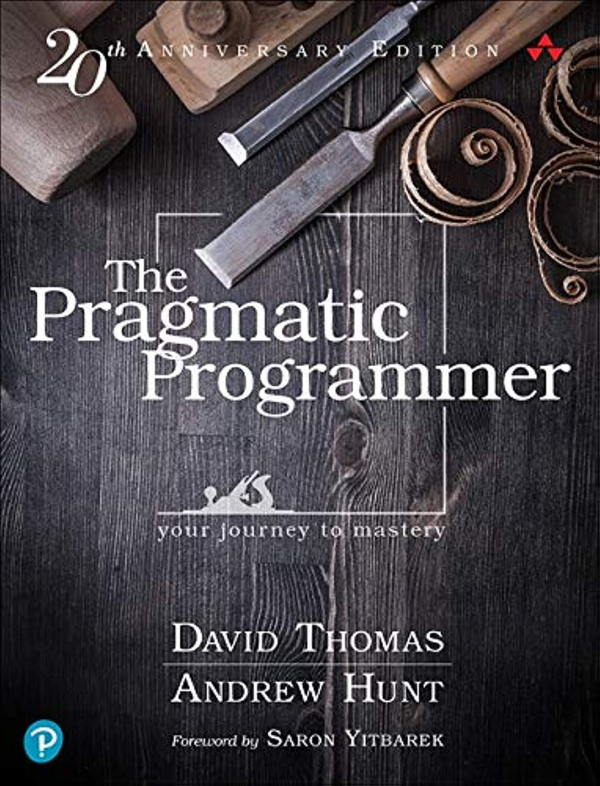

===================
The End of the Book
===================

This is the end.

Well, it could also be a beginning. There remains a massive skills shortage in the IT, especially in programming and development, so maybe for you it could be a beginning?

Remember that programming is a skill. And like all skills it is something that you develop over time. The first step is to master the basics, and then get to a place where you can learn more. Then you learn, improve, and learn some more. Every programmer, even those who been around for decades, is still learning.

Programming languages develop, and the ways in which we program develop. As I type this, the current version of Python is 3.11. One day there will be a Python 4. It will probably look rather like Python 3, but it will surely have new features that will improve the lives of Python programmers in the future.

Tools develop too. A modern IDE is there all the time, by your side, making suggestions and spotting errors. Even something that we now take for granted, like colour highlighting of code is quite new. Newer tools will embrace AI techniques, and who knows where that might lead?

This is one of those chapters here that mightn grow. But, at least at the start, let's keep it short with a few key ideas.

*Programming*, not Python
=========================

This book has been about Python. But it is really about programming. If you feel you can now "get by" in Python you can probably say the same about PHP, Java, and a bunch of other languages. You would need to do some study, but now you should know what you are looking for. Remember that every language has its idioms and ways of doing things - as when we have been *Pythonic* here - which are the things you have to learn.

When approaching a new language you should be looking to see what the structure is for a ``while`` and ``for`` loop. You should find out how ``if`` statements work, and how the language shows what is inside the loop. You should be checking the docs for a list of the provided data types. You will never have to learn programming from scratch again.

Never be afraid of Googling, and remember that StackOverflow really is your friend. *Every* developer uses both daily, and any that tells you otherwise is not telling the truth. Remember that the reasons experienced programmers seem to fix things easily is that they have made all the mistakes before, and they have seen the errors, and know the fixes. Learn from them, and be like them.

Possibly the most important thing to develop is your sense of *there must be a way to do this*. Before writing some new code, you need to have a sense of what the language you are using probably already provides. Or what you will be able to find in the equivalent of PyPi. A good deal of modern programming is putting together something new from stuff that already exists.

Python is currently one of the most popular languages out there. There is *a lot* of Python, and it is not going to go away any time soon. But what we have done here was *programming*.

Keep Up To Date
===============

Closely related to the comments above, is the need for a developer to keep up to date with programming, and with tech in general. New programming languages come and go. As I type this, some languages - looking at you, `Go <https://go.dev>`_ and `Kotlin <https://kotlinlang.org>`_ - are rapidly gaining traction and have a lot of fans. It will be interesting to see how they fare. Other languages (we'll miss you, `Ruby <https://www.ruby-lang.org/en/>`_ seem to be fading away. Developers need to know what is going on, if for no other reason than this is where the jobs will be in the future!

Other techs also impact on how programmers work. Programmers need a working knowledge of Cloud, Containers, Virtualisation, Continuous Integration and Continuous Deployment, DevOps, and all the other nice things currently trendy in the IT world. They at least need to be able to nod sensibly when these are mentioned, even if they do then need to go check WikiPedia.

`Docker <https://www.docker.com>`_, `Kubernetes <https://kubernetes.io>`_, and even `Jenkins <https://www.jenkins.io>`_ are all things to know about.

Keep Sharp
==========

Practice, practice, then practice some more.

Much programming practice comes on the job. Or you can get involved with Open Source projects, and develop skills that way.

One popular way to develop skills is through practice on short (but often fiendish) exercises called Code Kata. See, for example, `the original CodeKate site <http://codekata.com>`_. These are a way of "limbering up" before taking on a new task, or can be a way of getting some friendly competition going! There are plenty of other options - `CodeWars <https://www.codewars.com>`_ has built a whole community and awards coloured (virtual) belts, and `Coding Dojos <https://codingdojo.org/dojo/>`_ exist both online and in real life.

These all promote ways to learn and meet other developers. Improve your skills and enhance your career.

Important Reading
=================

There are many books about programming. But most of them are books about programming languages. There are far fewer books about programming itself.

.. warning::

    What follows is an opinion.

The best book to read about programming is *The Pragmatic Programmer* by Dave Thomas and Andy Hunt. It's been around for 20 years, and is a classic. It covers everything from career advice through to how to set up an IDE. The first three or four chapters of this book owe a lot to what's written here.

Like of lot of tech books, it's not cheap, so get it on the Birthday list.

We respectfully nod to this book.

And we should also nod to *Clean Code* by "Uncle" Bob Martin. Like the above, this book emphasises that programming is a *craft*. And it shows how it matters so much that code works *well*. It's just the same idea as a chair made of rough wood is something you can sit on, but a crafted piece of furniture is so much better.

AI and Programming
==================

Finally, AI, and specifically *Generative* AI is going to change the whole programming business. AI can now write most programs if given the spec, so where does that leave programmers?

In a way we have been using AI to help us program for a long time. Without getting into a definition of AI, many things that our IDEs do have an "intelligent" feel to them. Your IDE "understands" your code, and sometimes makes suggestions about how to improve it. Is that AI? Or is it just following some rules it's been given?

AI will come to be used to do some of the "grunt work" of programming. That's the stuff that exists in every problem, but needs to be made specific. Tools to do this are already being introduced in both PyCharm and VS Code, so there is no point in ignoring them. But, for the time being at least, programmers still have plenty of skills that AI does not. They could be summarised as *intuition* and *experience*.

AI cannot talk to users. It has never met users, and does not understand how they feel about the redesign of the interface in the system they use every day.

So, sure, AI will change the way programmer work, but it's not replacing us. Yet.

Takeaways
=========

There is simply one message from the end of the book.

You never stop learning programming. You have now started. Well done! But don't think you will ever, ever, finish.

So, farewell!
